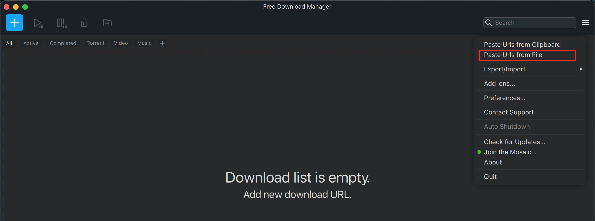

# khinsider-Downloader v1

## Requirements

- Python3
- Install python virtualenvironment
	`python3 -m pip install virtualenvironment`
- [FreeDownloadManager](https://www.freedownloadmanager.org/)

## Setup

- Clone this repository
- `cd` into the repository and create a new virtualenvironment
	`python3 -m virtualenv venv`
- Activate the virtualenvironment
	`source venv/bin/activate`
- Install the required modules
	`pip install -r requirements.txt`

## How this works?

- On running the script.py file, it will ask for 
	1. Url - URL of the album page on khinsider website
	2. Number of songe in the album, enter the value. If there are 30 songs, enter 30
	3. File Name, this is the name of the file, containing the song URLs, that will be generated. Use appropriate name, say, _mydownloadlist_
- The script will generate a new file, _mydownloadlist.txt_
- Open FreeDownloadManager and select the following option

- Point it to the file that was generated by the script, _mydownloadlist.txt_
- Wait for the download to finish
- Enjoy

## Leave a star if this helped.

